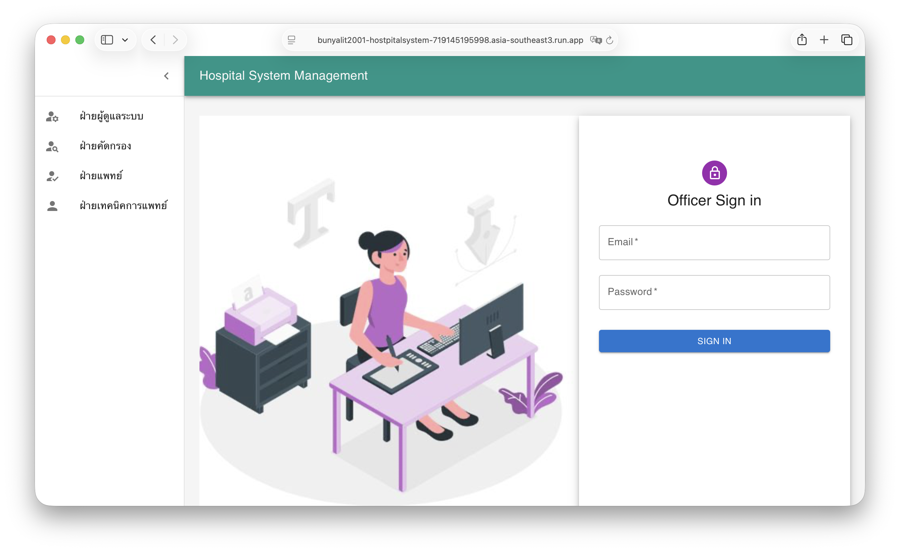
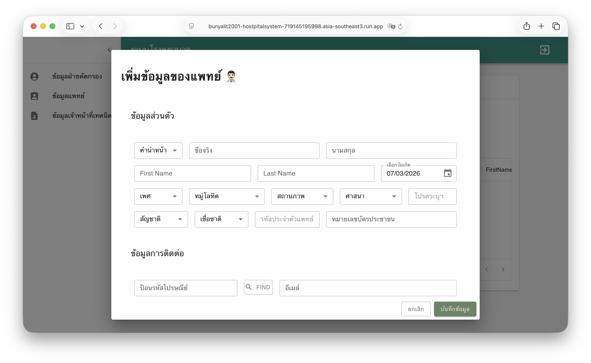

# Hospital Management System

เว็บแอปสำหรับจัดการ workflow ภายในโรงพยาบาล ตั้งแต่ลงทะเบียนผู้ป่วย การคัดกรอง การรักษา นัดหมาย จ่ายยา รับผู้ป่วยไว้รักษา จองห้องผ่าตัด ไปจนถึงผลแลปและการเบิกอุปกรณ์แลป

โปรเจกต์นี้จัดทำเป็น full-stack portfolio สำหรับแสดงความสามารถด้านการออกแบบระบบหลาย role, REST API, relational database, validation และ frontend workflow ที่เชื่อมกับ backend จริง

- [ระบบโรงพยาบาล DEMO](https://bunyalit2001-hostpitalsystem-719145195998.asia-southeast3.run.app/)

## ✨ Highlights

- **Multi-role workflow:** แยกการใช้งานตามบทบาท officer, screening officer, doctor และ medical employee
- **Hospital operation flow:** ครอบคลุมงานผู้ป่วย บุคลากร การรักษา การนัดหมาย ยา ห้องผ่าตัด แลป และอุปกรณ์
- **REST API backend:** พัฒนาด้วย Go, Gin, GORM พร้อม JWT authentication
- **React + TypeScript frontend:** แยกหน้าและเมนูตาม role เพื่อให้ flow การใช้งานชัดเจน
- **Database-ready:** รองรับ SQLite สำหรับ local และ PostgreSQL ผ่าน Docker/ENV
- **Validation tests:** มี unit tests สำหรับ business validation ฝั่ง backend



## 🏥 Core Features

- **Authentication & Role-based UI:** Login แยกตาม role และแสดงเมนูตามสิทธิ์ผู้ใช้
- **Patient Management:** ลงทะเบียน แก้ไข และติดตามข้อมูลผู้ป่วย
- **Clinical Workflow:** บันทึกการรักษา นัดหมาย จ่ายยา รับไว้รักษา และจองห้องผ่าตัด
- **Staff Management:** จัดการข้อมูลแพทย์ เจ้าหน้าที่คัดกรอง และเจ้าหน้าที่เทคนิคการแพทย์
- **Lab & Equipment:** บันทึกผลแลป จัดการอุปกรณ์ และคำขอเบิกอุปกรณ์แลป
- **Master Data:** ข้อมูลอ้างอิงสำหรับ dropdown เช่น เพศ คำนำหน้า โรค ยา ห้อง อาคาร แผนก

## 🧰 Tech Stack

| Layer | Technology |
| --- | --- |
| Frontend | React 18, TypeScript, Material UI, React Router |
| Backend | Go, Gin, GORM |
| Database | SQLite, PostgreSQL |
| Auth | JWT, bcrypt |
| Test | Go unit tests |
| Deployment Prep | Dockerfile, Docker Compose |

## 📁 Project Structure

```text
HospitalSystem/
├── backend/      # Go REST API, GORM models, seed data, validation tests
├── frontend/     # React TypeScript web application
├── FLOW.md       # API flow, route map และ role flow
└── docker-compose.yml
```

## 🚀 Quick Start

### 1. Run Backend

```bash
cd backend
go mod download
go run main.go
```

Backend จะรันที่:

```text
http://localhost:8080
```

ถ้าไม่ตั้งค่า PostgreSQL ระบบจะ fallback ไปใช้ SQLite local ที่ `backend/config.db`

### 2. Run Frontend

เปิด terminal อีกหน้าต่าง:

```bash
cd frontend
npm install
npm start
```

Frontend จะเรียก API ที่ `http://localhost:8080`

### 3. Run with Docker Compose

```bash
docker compose up --build
```

Compose เตรียม PostgreSQL และ backend โดยใช้:

```text
DB_TYPE=postgres
DATABASE_URL=host=db user=admin password=password dbname=hospital_db port=5432 sslmode=disable
```

## 🔐 Test Login

ระบบมี seed data ตอน backend startup ผ่าน `backend/entity/Setup.go`

| Role | Email | Password |
| --- | --- | --- |
| Officer | `aa@gmail.com` | `1234` |
| Officer | `ss@gmail.com` | `1234` |



บัญชี role อื่นสามารถสร้างและทดสอบผ่าน flow ของระบบ อ่านลำดับ flow และ API path เพิ่มเติมได้ที่ [FLOW.md](./FLOW.md)

## ✅ Testing

Backend:

```bash
cd backend
go test ./...
```

Frontend:

```bash
cd frontend
npm test
```

## 🎯 Why This Project Stands Out

โปรเจกต์นี้ไม่ใช่ CRUD หน้าเดียว แต่เป็นระบบงานโรงพยาบาลที่มีหลาย domain เชื่อมต่อกันผ่าน role และ workflow จริง จุดเด่นคือการออกแบบ full-stack flow ตั้งแต่ frontend, API, database model, authentication, validation test และการเตรียม container สำหรับ deployment

อ่านรายละเอียด API และลำดับการทดสอบได้ที่ [FLOW.md](./FLOW.md)
